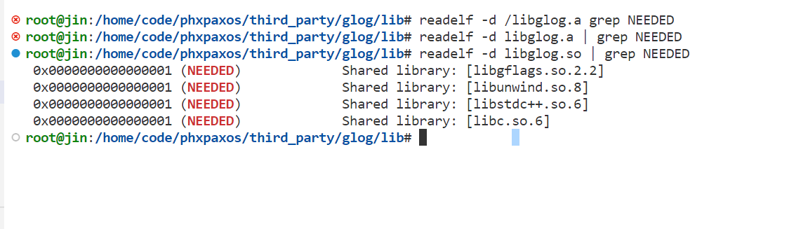

root@jin:/home/code/phxpaxos/third_party# find / -name libunwind.so
/usr/lib/llvm-14/lib/libunwind.so
/usr/lib/x86_64-linux-gnu/libunwind.so
find: ‘/run/user/1000/doc’: Permission denied
find: ‘/run/user/1000/gvfs’: Permission denied
root@jin:/home/code/phxpaxos/third_party# 
root@jin:/home/code/phxpaxos/third_party# 
root@jin:/home/code/phxpaxos/third_party# 
root@jin:/home/code/phxpaxos/third_party# find / -name libunwind.so.8
/usr/lib/x86_64-linux-gnu/libunwind.so.8
find: ‘/run/user/1000/doc’: Permission denied
find: ‘/run/user/1000/gvfs’: Permission denied
/snap/gnome-42-2204/126/usr/lib/x86_64-linux-gnu/libunwind.so.8
/snap/gnome-42-2204/120/usr/lib/x86_64-linux-gnu/libunwind.so.8
root@jin:/home/code/phxpaxos/third_party# cp /usr/lib/x86_64-linux-gnu/libunwind.so.8 libunwind8.so
root@jin:/home/code/phxpaxos/third_party# 
root@jin:/home/code/phxpaxos/third_party# ls
autoinstall.sh  bin  gflags  glog  gmock  grpc  include  leveldb  lib  libunwind8.so  protobuf  share
root@jin:/home/code/phxpaxos/third_party# cp /usr/lib/x86_64-linux-gnu/libunwind.so.8 /usr/lib/libunwind8.so
root@jin:/home/code/phxpaxos/third_party# 

root@jin:/home/code/phxpaxos/third_party/glog/lib# readelf -d /libglog.a grep NEEDED
root@jin:/home/code/phxpaxos/third_party/glog/lib# readelf -d libglog.a | grep NEEDED
root@jin:/home/code/phxpaxos/third_party/glog/lib# readelf -d libglog.so | grep NEEDED
 0x0000000000000001 (NEEDED)             Shared library: [libgflags.so.2.2]
 0x0000000000000001 (NEEDED)             Shared library: [libunwind.so.8]
 0x0000000000000001 (NEEDED)             Shared library: [libstdc++.so.6]
 0x0000000000000001 (NEEDED)             Shared library: [libc.so.6]
root@jin:/home/code/phxpaxos/third_party/glog/lib# 
